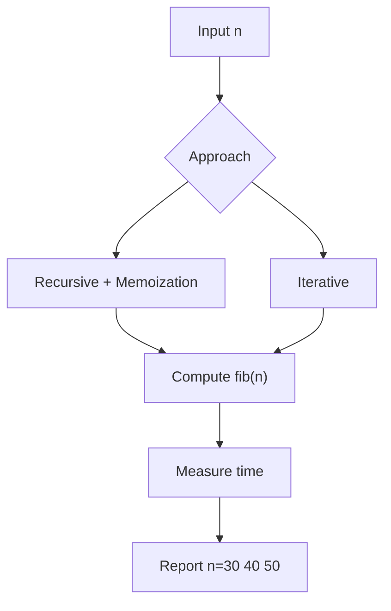

# Fibonacci: Recursive vs Iterative (Python & JavaScript)

## Overview
- Implements Fibonacci with recursive memoization and iterative approaches in Python and JavaScript
- Benchmarks both approaches for `n = 30, 40, 50`
- Explains time and space complexity
- Includes CI and a Mermaid diagram

## Stack
- Python (standard library only)
- Node.js (built-in `node:test` only)

## How To Run
- Python tests: `python -m unittest -v python.tests.test_fibonacci`
- Python benchmark: `python -m python.benchmark` (or `python python/benchmark.py`)
- Node tests: `node --test js/tests/fibonacci.test.mjs`
- Node benchmark: `node js/benchmark.js`

## Benchmark Results (Sample)
- Node.js measurements on this machine:

```
Node.js Fibonacci Benchmarks
method    n=30    n=40    n=50 (ms)
recursive_memo    0.007    0.008    0.007
iterative         0.000    0.001    0.001
```

- Python benchmark artifacts are uploaded in CI under `python-bench`; locally run `python python/benchmark.py`. Relative performance ordering is the same: iterative ≤ recursive memoized ≪ naive recursive.

### Python (this machine)

```
Python Fibonacci Benchmarks
method    n=30    n=40    n=50 (ms)
recursive_memo    0.009    0.011    0.013
iterative         0.001    0.001    0.002
```

## Complexity
- Naive recursive: time ~ O(φ^n) (often stated O(2^n)); space O(n)
- Recursive with memoization: time O(n); space O(n)
- Iterative: time O(n); space O(1)

## Diagram


## Files
- `python/fibonacci.py` — recursive memoization, iterative
- `python/benchmark.py` — timings for 30/40/50
- `python/tests/test_fibonacci.py` — unit tests
- `js/fibonacci.js` — recursive memoization, iterative
- `js/benchmark.js` — timings for 30/40/50
- `js/tests/fibonacci.test.mjs` — unit tests
- `.github/workflows/ci.yaml` — CI for Python and Node
- `.gitignore` — includes `.trae\documents`

## Notes
- Implementations avoid comments per requirement; clarity via naming
- Benchmarks run 1 warm-up + 5 trials; average reported in ms